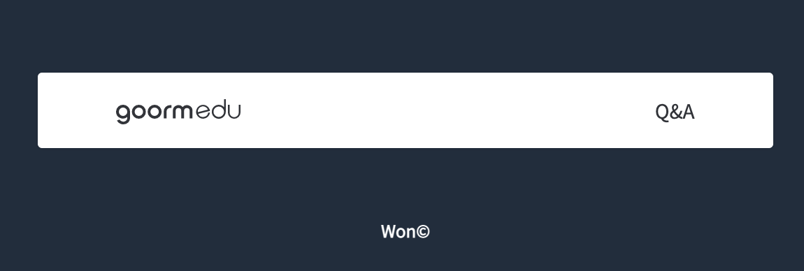

## HTML 만들기

### 훈련폴더에 있는 .html, .css, 결과물에 대한 모든 저작권은 [김버그](https://youtube.com/c/kimbug)님께 있습니다. kimbug&copy;

---

### Ad Banner

---

### Google Search Result Item

---

### Feature Box

---

### Logo in Header

---

### Breadcrumb &amp; Pagination

---

### Product Card

---

### Instagram User Profile

---

### Receipt

---

### Github Dropdown Menu

---