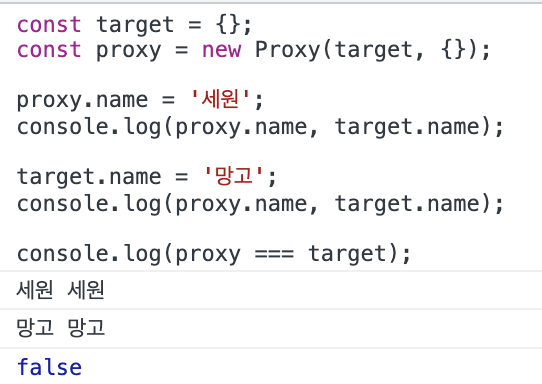
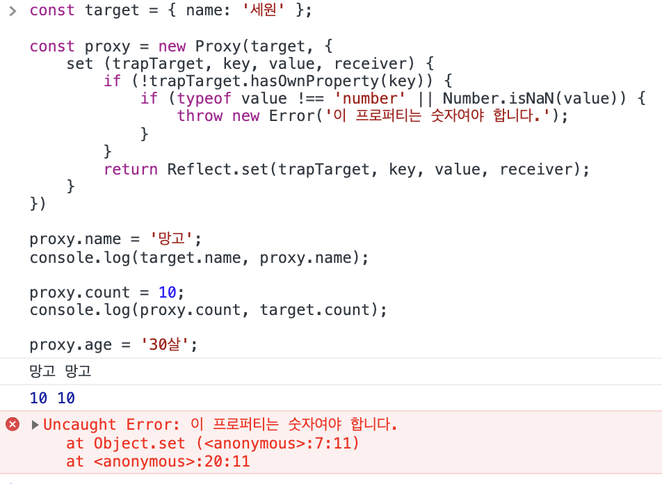
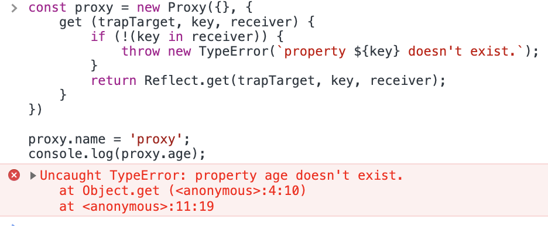
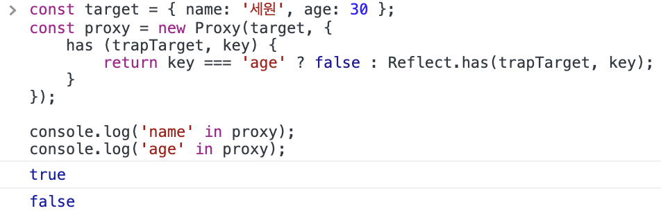
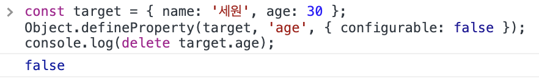
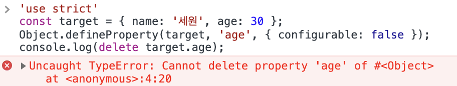
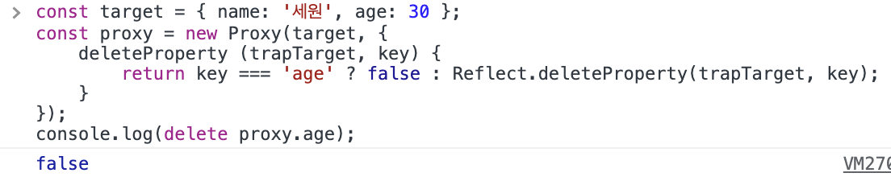
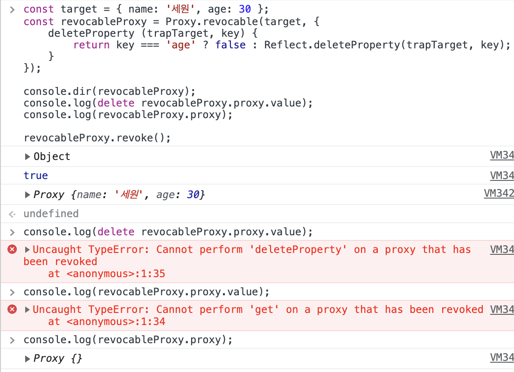
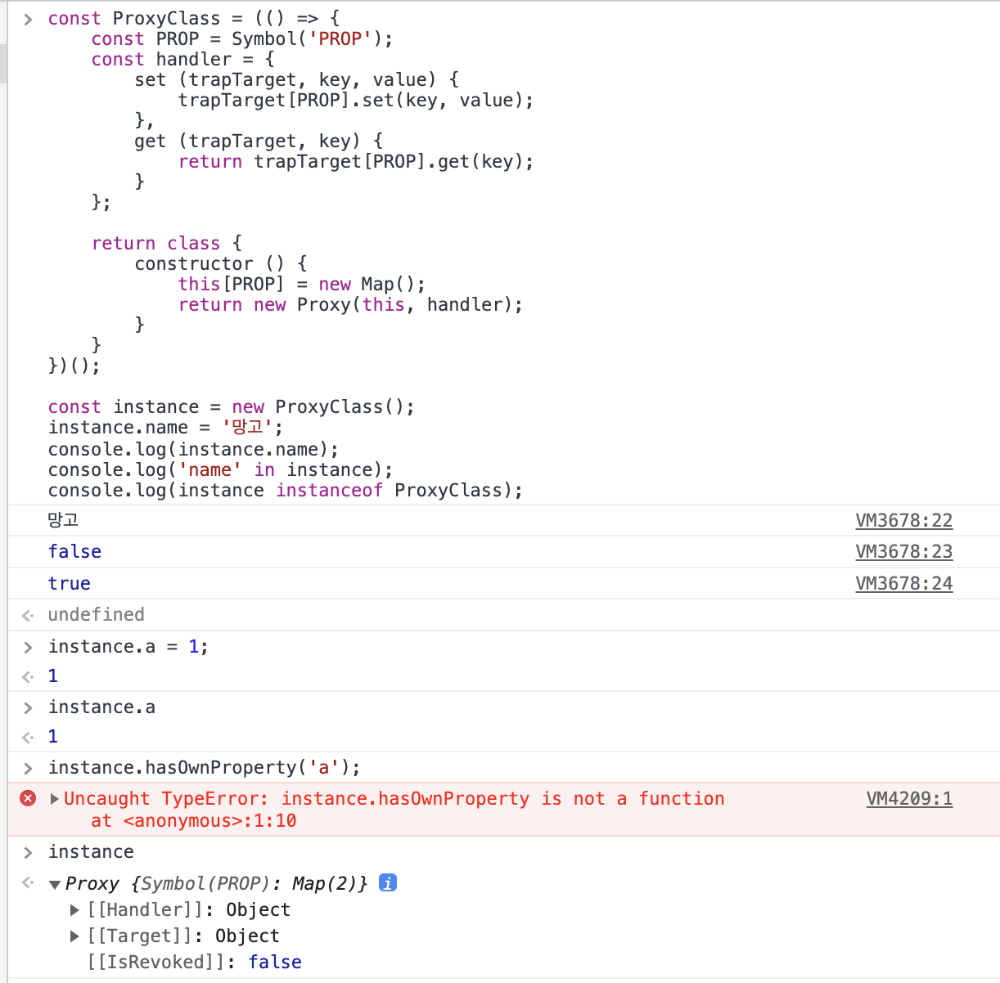
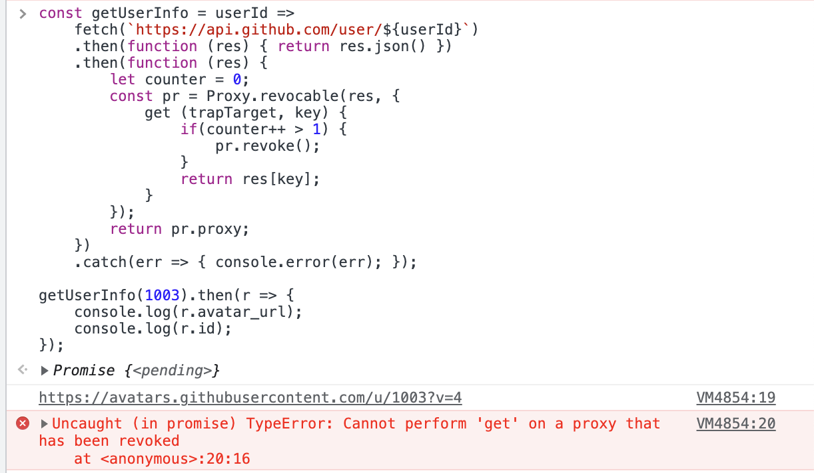

# ES2015

## Proxy와 Reflection

```javascript
	const p = new Proxy(target, handler);
```

- Proxy는 객체(target)의 기본동작을 가로채 다른 동작들(handler객체 내부의 함수들)을 수행케 함

- '트랩'을 이용하여 자바스크립트 엔진 내부의 저수준 연산을 가로챔 <br/>
우리가 통상 사용하는 함수들은 고레벨, 그 함수를 사용할 때 자바스크립트 내부적으로 일어나는 곳

- Proxy가 오버라이딩할 수 있는 기본동작들은 Reflect에 정의되어 있음, Proxy의 트랩과 Reflect의 메소드는 1:1 매칭

---

### Proxy - Reflection 매치

| Proxy Trap | 기본동작 | 오버라이드하는 대상|
|:---:|:---:|:---:|
|get|`Reflect.get()`|getter|
|set|`Reflect.set()`|setter|
|has|`Reflect.has()`|in 연산자|
|deleteProperty|`Reflect.deleteProperty()`|delete 연산자|
|getPrototypeOf|`Reflect.getPrototypeOf()`|`Object.getPrototypeOf()`|
|setPrototypeOf|`Reflect.setPrototypeOf()`|`Object.setPrototypeOf()`|
|isExtensible|`Reflect.isExtensible()`|`Object.isExtensible()`|
|preventExtensions|`Reflect.preventExtension()`|`Object.preventExtensions()`|
|getOwnPropertyDescriptor|`Reflect.getOwnPropertyDescription()`|`Object.getOwnPropertyDescriptor()`|
|defineProperty|`Reflect.defineProperty()`|`Object.defineProperty()`|
|ownKeys|`Reflect.ownKeys()`|`Object.keys()`,<br/>`Object.getOwnPropertyNames()`,<br/>`Object.getOwnPropertySymbols()`|
|apply|`Reflect.apply()`|함수 호출시|
|construct|`Reflect.constructor()`|new 연산자와 함께 함수 호출시|

---

### 종류별 분류

- 속성제어 : get, set
- 속성정의 : defineProperty, deleteProperty
- for..in : has, enumerate, ownKeys
- 속성기술 : isExtensible, preventExtensions, getOwnPropertyDescriptor
- 객체생성: construct
- prototype: getPrototypeOf, setPrototypeOf
- 함수호출: apply

### 어디에 써먹을까?

1. 로깅 / 관찰시
1. 접근제한 (권한 - 읽기전용, 접근금지 등)
1. 유효성 검증

---

### 예제

```javascript
// 간단 구현
const target = {};
const proxy = new Proxy(target, {});

proxy.name = '세원';
console.log(proxy.name, target.name);

target.name = '망고';
console.log(proxy.name, target.name);

console.log(proxy === target);
```


<br/>

```javascript
// set 트랩 - 유효성 검증
const target = { name: '세원' };

const proxy = new Proxy(target, {
	set (trapTarget, key, value, receiver) {
		if (!trapTarget.hasOwnProperty(key)) {
			if (typeof value !== 'number' || Number.isNaN(value)) {
				throw new Error('이 프로퍼티는 숫자여야 합니다.');
			}
		}
		return Reflect.set(trapTarget, key, value, receiver);
	}
});

proxy.name = '망고';
console.log(target.name, proxy.name);

proxy.count = 10;
console.log(proxy.count, target.count);

proxy.age = '30살';
```


<br/>
<br/>

```javascript
// get 트랩 - 유효성 검증
const proxy = new Proxy({}, {
	get (trapTarget, key, receiver) {
		if (!(key in receiver)) {
			throw new TypeError(`property ${key} doesn't exist.`);
		}
		return Reflect.get(trapTarget, key, receiver);
	}
});

proxy.name = 'proxy';
console.log(proxy.age);
```


<br/>
<br />

```javascript
// has 트랩 - 프로퍼티 숨기기
const target = { name: '세원', age: 30 };
const proxy = new Proxy(target, {
	has (trapTarget, key) {
		return key === 'age' ? false : Reflect.has(trapTarget, key);
	}
});

console.log('name' in proxy);
console.log('age' in proxy);
```


<br/>
<br/>

```javascript
// deleteProperty 트랩 - 프로퍼티 제거 방지하기 - 1
const target = { name: '세원', age: 30 };
Object.defineProperty(target, 'age', { configurable: false });
console.log(delete target.age);
```


<br/>
<br/>

```javascript
// deleteProperty 트랩 - 프로퍼티 제거 방지하기 - 2
'use strict'
const target = { name: '세원', age: 30 };
Object.defineProperty(target, 'age', { configurable: false });
console.log(delete target.name);
```


<br/>
<br/>

```javascript
// deleteProperty 트랩 - 프로퍼티 제거 방지하기 - 3
const target = { name: '세원', age: 30 };
const proxy = new Proxy(target, {
	deleteProperty (trapTarget, key) {
		return key === 'age' ? false : Reflect.deleteProperty(trapTarget, key);
	}
});
console.log(delete proxy.age);
```


<br/>
<br/>

---

### `Proxy.revocable`

```javascript
const target = { name: '세원', age: 30 };
const revocableProxy = Proxy.revocable(target, {
	deleteProperty (trapTarget, key) {
		return key === 'age' ? false : Reflect.deleteProperty(trapTarget, key);
	}
});

console.dir(revocableProxy);
console.log(delete revocableProxy.proxy.value);
console.log(revocableProxy.proxy);

revocableProxy.revoke();
console.log(delete revocableProxy.proxy.value);
console.log(revocableProxy.proxy.value);
console.log(revocableProxy.proxy);
```


<br/>

---

### 모든 프로퍼티의 은닉화

```javascript
const ProxyClass = (() => {
	const PROP = Symbol('PROP');
	const handler = {
		set (trapTarget, key, value) {
			trapTarget[PROP].set(key, value);
		},
		get (trapTarget, key) {
			return trapTarget[PROP].get(key);
		}
	};

	return class {
		constructor () {
			this[PROP] = new Map();
			return new Proxy(this, handler);
		}
	}
})();

const instance = new ProxyClass();
instance.name = '망고';
console.log(instance.name);
console.log('name' in instance);
console.log(instance instanceof ProxyClass);
```


<br/>

---

### 한시적 접근 허용

```javascript
// 새로고침 이전에 어떤 행동을 해도 다시 실행시키고 싶지 않은 경우 등에 사용

const getUserInfo = userId =>
	fetch(`https://api.github.com/user/${userId}`)
	.then(function (res) { return res.json() })
	.then(function (res) {
		let counter = 0;
		const pr = Proxy.revocable(res, {
			get (trapTarget, key) {
				if(counter++ > 2) {
					pr.revoke();
				}
				return res[key];
			}
		});
		return pr.proxy;
	})
	.catch(err => { console.error(err); });

getUserInfo(1003).then(r => {
	console.log(r.avatar_url);
	console.log(r.id);
});
```


<br/>

---

## Module 개념

- 용도에 따라 여러 코드조각들을 파일 단위로 나눠 분류한 것
- 모듈은 이론적으로 다음 사항을 허용해야함
	- 코드 추상화 : 특수한 라이브러리에 기능을 위임하여 실제 구현의 복잡도를 이해할 필요가 없음
	- 코드 캡슐화 : 코드를 변경하지 않으려면 모듈 내부에 코드를 숨김
	- 코드 재사용 : 같은 코드를 반복해서 작성하는 것을 피함 
	- 의존성 관리 : 코드를 다시 작성하지 않고도 쉽게 의존성 변경

---

## ES6 Module

- `export`, `import`문은 파일 단위의 영역을 기준으로 Top-level 영역에서만 사용가능

<br/>

### `export`
#### <strong>Named export</strong>
```javascript
export { name1, name2, ..., nameN }
export const foo = Math.sqrt(2);
```

#### <strong>default export</strong>
```javascript
export default [값 or 식]
```
```javascript
export default class {}
export default function () {}
// Uncaught SyntaxError: Identifier '*default*' has already been declared
```

#### <strong>Module Namespace Object `*`</strong>
```javascript
// 
export * from 'module1.js';
// default export는 호출 X
```

#### <strong>A as B</strong>
```javascript
const milk = 'i am milk';
export { milk as drink };
```

---

### `import`

#### <strong>Named import</strong>
```javascript
import { member1, member2 } from 'module-name';
```

#### <strong>Module Namespace Object `*`</strong>
```javascript
import * from 'module-name';
import * as module1 from 'module-name';
```

#### <strong>DEfault Object</strong>
```javascript
import member1 from 'module-name';
```

#### <strong>A as B</strong>
```javascript
import { default as m1, member2 as m2 } from 'module-name';
```

#### <strong>Non-binding Object</strong>
```javascript
import 'module-name';
// css 사용할 때 사용
```

#### <strong>mixed</strong>
```javascript
import member1, { member2 as m2, member3 } from 'module-name';
```

---

## Etc

### 배열

- `Array.of(...elements)`

	```javascript
	Array.of(1, 2, 3);
	Array.of(undefined);
	```

- `Array.prototype.find(callback)`, `Array.prototype.findIndex(callback)`

	```javascript
	// find 콜백 조건을 만족하는 첫번째 요소 반환
	[10, 20, 30, 40, 50].find(v => v > 20);

	// findIndex 콜백 조건을 만족하는 첫번째 요소의 인덱스 반환
	[10, 20, 30, 40 ,50].findIndex(v => v > 30);
	```

- `Array.prototype.fill(value[, start = 0[end = this.length]])`

	```javascript
	[1, 2, 3, 4, 5].fill(10); // [10, 10, 10, 10, 10]
	[1, 2, 3, 4, 5].fill(10, 2, 4); // [1, 2, 10, 10, 5]
	[1, 2, 3, 4, 5].fill(10, -4, -1); // [1, 10, 10, 10, 5]
	[1, 2, 3, 4, 5].fill(10, -3); // [1, 2, 10, 10, 10]
	new Array(10).fill(0);
	```

