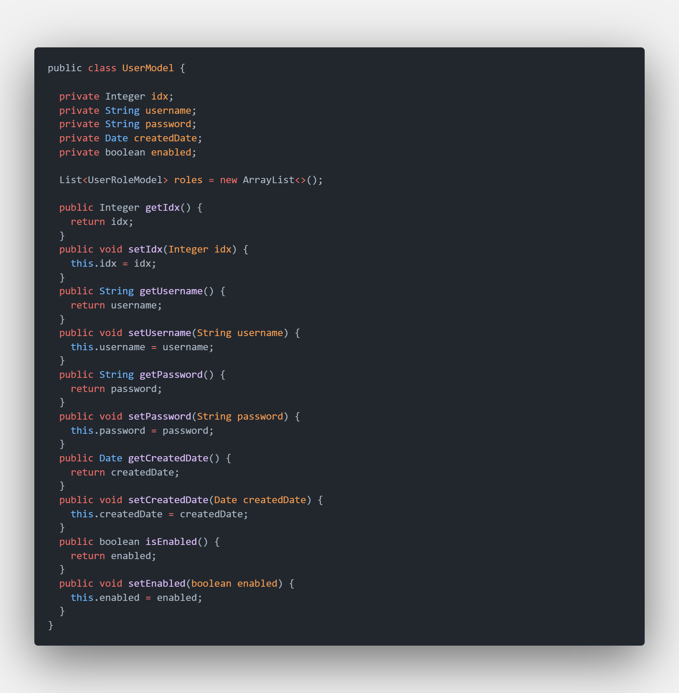
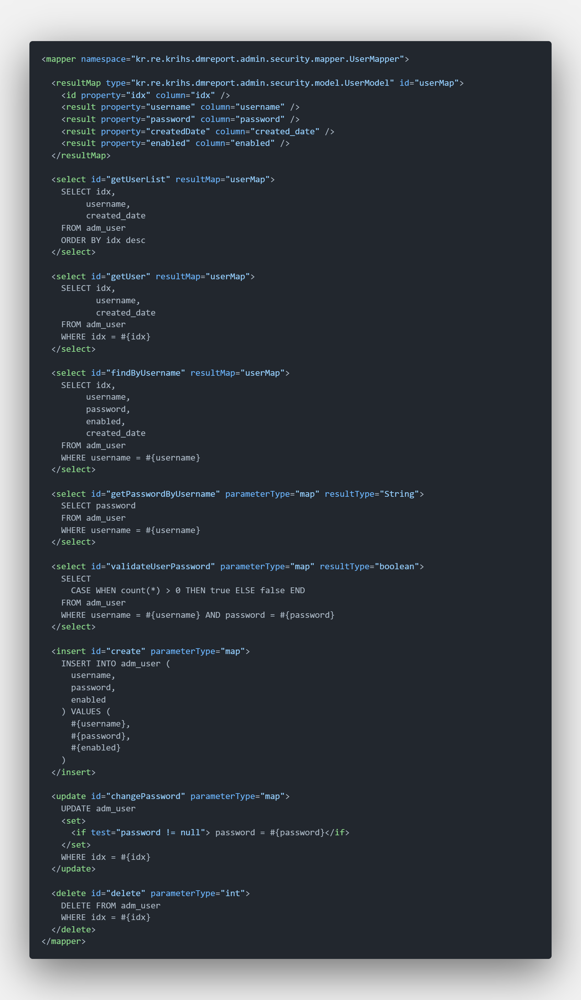

# 회사에서 프로젝트 처음으로 혼자서 처음부터 끝까지(feat.interactive)

회사에서 특정 프로젝트의 일부를 구현하는데 있어, DB 설계부터 Front-end까지 해볼 수 있는 기회를 주셨다. 입사 이후부터 React만 사용하던 내가 back-end와 jsp까지 해볼 수 있는 기회라 많이 성장할 수 있을 것이라 판단되어 기록해보고자 한다.

<br />

---

> 요구사항 정리

### <strong>ToDo</strong>

- 관리자 스프링 시큐리티 로그인, 로그아웃, 패스워드 변경 기능
- 관리자 계정 로그인 로그관리
- 게시판 댓글, 대댓글, 페이징, 검색, 관리자 세션 확인, 게시글 및 댓글 관리자 삭제 기능
- 위 기능에 필요한 데이터베이스 구축, Back-end 개발, Front-end 개발

<br />

### <strong>Requirements</strong>

- session을 사용한 로그인 기능 구현
- 패스워드 암호화 전송, 단방향 암호화 알고리즘 사용, 이중암호화(SHA-256 -> Bcrypt)
- 게시글, 댓글, 대댓글의 익명성
- 관리자의 경우 게시글, 댓글, 대댓글을 비밀번호 입력 없이 삭제할 수 있도록 구현
- 게시글, 댓글 Sequence 필수
- 게시판 데이터베이스와 댓글 & 대댓글 데이터베이스의 분리
- 게시판 및 댓글 대댓글 작성시간은 timestamp로 관리
- 필요기능의 REST API 작성

### <strong>Use</strong>

- Java 1.8 & JSP
- PostgreSQL

<br />

---

가장 먼저 해야할 일은 데이터베이스 설계이다.

데이터베이스 설계 순서

1. 요구 분석
1. 개념적 설계
1. 논리적 설계
1. 물리적 설계
1. 구현

<br />

### <strong>개념적 설계(정보 모델링, 개념화)</strong>

- 정보의 구조를 얻기 위해 현실 게계의 무한성과 계속성을 이해하고, 다른 사람과 통신하기 위해 현실 세계에 대한 인식을 추상적 개념으로 표현
- 스키마 모델링과 트랜잭션 모델링 병행
- 요구 분석 단계에서 나온 결과(요구 조건 명세)를 DBMS에 독립적인 E-R 다이어그램(r개체 관계도)으로 작성
- DBMS에 독립적인 개념 스키마를 설계.

<br />

### <strong>논리적 설계(데이터 모델링)</strong>

- 현실 세계의 자료를 컴퓨터가 처리할 수 있는 물리적 저장장치에 저장할 수 있도록 변환하기 위해 특정 DBMS가 지원하는 논리적 자료 구조로 변환
- 개념 세계의 데이터를 필드로 기술된 데이터 타입과 이 데이터 타입들 간의 관계로 표현되는 논리적 구조의 데이터로 모델화
- 개념적 설계 = 개념 스키마 설계
- 논리적 설계 = 개념 스키마 평가, 정제 그리고 특정 DBMS에 종속적인 논리적 스키마 설계
- 트랜잭션의 인터페이스를 설계
- 관계형 데이터베이스라면 테이블을 설계하는 단계

<br />

### <strong>물리적 설계(데이터 구조화)</strong>

- 논리적 설계 단계에서 논리적 구조로 표현된 데이터를 디스크 등의 물리적 저장장치에 저장할 수 있는 물리적 구조의 데이터베이스로 변환
- 데이터베이스 파일의 저장 구조, 레코드의 형식, 접근 경로
  트랜잭션 작성
- 물리적 설계 옵션 선택 시 고려사항
  : 반응 시간(Response Time), 공간 활용도(Space Utilization), 트랜잭션 처리량(Transaction Throughput)

<br />

> Notes: 해야되는게 굉장히 많다. 실제로 설계가 잘못되면 문제가 커진다. 하지만 나에게 주어진 시간은 많지 않다. 주의해야될 내용들을 숙지한 상태로 다음 단계를 진행해보자.

<br />

---

### 데이터베이스 설계, 테이블에서 필요한 정보

> 테이블 컬럼을 정해보자.

- 계정 테이블
  - idx: 관리자 계정 인덱스 			// integer, sequence auto increment
  - username: 관리자 아이디 			// character varying
  - password: 관리자 패스워드 			// character varying
  - created_date: 작성된 날짜시간 // timestamp with timezone

<br />

- 로그관리 테이블
  - idx: 로그 인덱스								// integger, sequence auto increment
  - conn_id: 관리자 계정 인덱스			// integer
  - conn_addr: 접속 IP						 // character varying
  - created_date: 작성된 날짜시간	 // timestamp with time zone

<br />

- 계정 권한 테이블
  - idx: 계정 권한 인덱스					// integger, sequence auto increment
  - user_idx: 관리자 계정 인덱스	// integer
  - authority: 권한					 		 // character varying

<br />

- 익명 게시판 테이블
  - idx: 게시글 인덱스								// integer, sequence auto increment
  - writer: 익명의 작성자							// character varying
  - title: 게시글 제목								// character varying, 30자 이하
  - contents: 게시글 내용							// text, 1000자 이하
  - password: 글의 수정, 삭제 시 필요 // character varying
  - created_date: 작성된 날짜시간			// timestamp with timezone
  - updated_date: 업데이트된 날짜시간 // timestamp with timezone
  - type_code: 타입코드							  // character varying
	- deleted : 삭제여부								// boolean

<br />

- 익명 댓글 대댓글 테이블
  - idx: 댓글 인덱스											  // integer, sequence auto increment
  - writer: 익명의 작성자(무작위 문자열)	  // character varying
  - contents: 댓글 내용 									 // text
  - passwd: 글의 수정, 삭제 시 필요 			 // character varying
  - post_num: 게시글 idx								  // integer
  - created_date: 작성된 날짜시간					// timestamp with timezone
  - updated_date: 업데이트된 날짜시간			// timestamp with timezone
  - step: 댓글과 대댓글을 구분						// integer
  - reply_num: 댓글과 대댓글 순서 구분		// integer
  - group_num: 댓글 그룹구분에 사용되며 댓글 인덱스를 부여, 대댓글의 경우 자신 대신 부모의 인덱스를 저장 => 특정 댓글에 종속되어있는 것을 표시 // integer
	- deleted : 삭제여부										// boolean

<br />
<br />

### Table

> 테이블 생성

관리자, 관리자 로그, 익명 게시판, 익명 댓글 대댓글에 대한 테이블을 생성해보자.

먼저 Sequence를 사용해야하기 때문에 각 테이블 별 필요 Sequence를 생성한다.

<details>
<summary>테이블 생성 펼치기 / 접기</summary>
<div markdown="1">


```
CREATE SEQUENCE public.[테이블 시퀀스명]
    INCREMENT 1
    START 1
    MINVALUE 1
    MAXVALUE 9223372036854775807
    CACHE 1;

ALTER SEQUENCE public.[테이블명]
    OWNER TO [DB 유저명];
```

> Note: 사용할 sequence를 생성하고 sequence의 오너를 사용중인 DB 유저명으로 변경

<br />

다음은 테이블 생성

```
CREATE TABLE public.[관리자 테이블명]
(
    idx integer NOT NULL DEFAULT nextval('adm_user_idx_seq'::regclass),
    username character varying(64) COLLATE pg_catalog."default" NOT NULL,
    passwd character varying(512) COLLATE pg_catalog."default" NOT NULL,
    created_date timestamp with time zone DEFAULT now(),
		enabled boolean,
    CONSTRAINT adm_user_pk PRIMARY KEY (idx),
    CONSTRAINT adm_user_username_key UNIQUE (username)
)
WITH (
    OIDS = FALSE
)
TABLESPACE pg_default;

ALTER TABLE public.[관리자 테이블명]
    OWNER to [DB 유저명];
```

```
CREATE TABLE public.[관리자 로그 테이블명]
(
    idx integer NOT NULL DEFAULT nextval('adm_user_log_idx_seq'::regclass),
    conn_id integer,
    conn_addr character varying(128) COLLATE pg_catalog."default",
    created_date timestamp with time zone DEFAULT now(),
    CONSTRAINT adm_user_log_connect_pk PRIMARY KEY (idx)
)
WITH (
    OIDS = FALSE
)
TABLESPACE pg_default;

ALTER TABLE public.[관리자 로그 테이블명]
    OWNER to [DB 유저명];
```

```
CREATE TABLE public.[계정 권한 테이블명]
(
    idx integer NOT NULL DEFAULT nextval('adm_user_role_idx_seq'::regclass),
    user_idx integer NOT NULL,
    authority character varying(64) COLLATE pg_catalog."default" NOT NULL,
    CONSTRAINT adm_user_role_pk PRIMARY KEY (idx),
    CONSTRAINT adm_user_role_user_idx_fkey FOREIGN KEY (user_idx)
        REFERENCES public.adm_user (idx) MATCH SIMPLE
        ON UPDATE NO ACTION
        ON DELETE NO ACTION
)
WITH (
    OIDS = FALSE
)
TABLESPACE pg_default;

ALTER TABLE public.[관리자 로그 테이블명]
    OWNER to [DB 유저명];
```


```
CREATE TABLE public.[익명 게시판 테이블명]
(
    idx integer NOT NULL DEFAULT nextval('anonymous_board_idx_seq'::regclass),
    writer character varying(64) COLLATE pg_catalog."default" NOT NULL,
    title character varying(256) COLLATE pg_catalog."default" NOT NULL,
    contents text COLLATE pg_catalog."default" NOT NULL,
    passwd character varying(512) COLLATE pg_catalog."default" NOT NULL,
    created_date timestamp with time zone DEFAULT now(),
    updated_date timestamp with time zone DEFAULT now(),
    type_code character varying(3) COLLATE pg_catalog."default",
		deleted boolean,
    CONSTRAINT [PK명] PRIMARY KEY (idx)
)
WITH (
    OIDS = FALSE
)
TABLESPACE pg_default;

ALTER TABLE public.[익명 게시판 테이블명]
    OWNER to [DB 유저명];
```

```
CREATE TABLE public.[익명 댓글 대댓글 테이블명]
(
    idx integer NOT NULL DEFAULT nextval('anonymous_reply_idx_seq'::regclass),
    writer character varying(64) COLLATE pg_catalog."default" NOT NULL,
    contents text COLLATE pg_catalog."default" NOT NULL,
    passwd character varying(512) COLLATE pg_catalog."default" NOT NULL,
    post_num integer NOT NULL,
    created_date timestamp with time zone DEFAULT now(),
    updated_date timestamp with time zone DEFAULT now(),
    step integer NOT NULL,
    reply_num integer NOT NULL,
    group_num integer NOT NULL,
		deleted boolean,
    CONSTRAINT [PK명] PRIMARY KEY (idx),
    CONSTRAINT [FK명] FOREIGN KEY (post_num)
        REFERENCES public.[익명 테이블 테이블명] (idx) MATCH SIMPLE
        ON UPDATE NO ACTION
        ON DELETE CASCADE
)
WITH (
    OIDS = FALSE
)
TABLESPACE pg_default;

ALTER TABLE public.[익명 댓글 대댓글 테이블명]
    OWNER to [DB 유저명];
```

> Note: sequence, NOT NULL, PK, FK, UK, CASCADE 설정 <br />
> COLLATE의 경우 대소문자 구분, 문자열 정렬, like 문 사용 시 인덱스 사용여부 결정 등에 영향을 미친다. TABLESPACE의 경우 필요 시 커스텀해서 사용한다.

</div>
</details>

<br />
<br />

### Query

<strong>모든 API 기능에 대해서 CRUD를 작성</strong> 요구사항 조건이 있었다. <br />
먼저, 만들어야하는 API 기능을 리스트업 해보자.

- API List
  - 관리자 계정
    - 관리자 계정 생성
		- 관리자 계정 패스워드 변경
		- 관리자 계정 로그 조회
    - 관리자 계정 로그 생성
    - 로그인(Spring Security)
    - 로그아웃(Spring Security)
  - 익명 게시판
		- 게시글 리스트 조회
		- 게시글 상세보기
		- 게시글 생성
		- 게시글 수정
		- 게시글 삭제
		- 관리자에 의한 게시글 삭제
  - 댓글 대댓글
		- 게시글에 달려있는 댓글 대댓글 리스트 조회
		- 댓글 대댓글 생성
		- 댓글 대댓글 삭제
		- 관리자에 의한 댓글 대댓글 삭제

<br />

### Model

<details>
<summary>Model 펼치기 / 접기</summary>
<div markdown="1">



<br />


<br />


<br />


</div>
</details>

<br />

### Mapper

<details>
<summary>Mapper 펼치기 / 접기</summary>
<div markdown="1">



<br />


<br />


<br />


</div>
</details>

<br />

### Service

<details>
<summary>서비스 펼치기 / 접기</summary>
<div markdown="1">


<br />


<br />


<br />


</div>
</details>

<br />

### Controller

<details>
<summary>컨트롤러 펼치기 / 접기</summary>
<div markdown="1">


<br />


<br />


</div>
</details>
